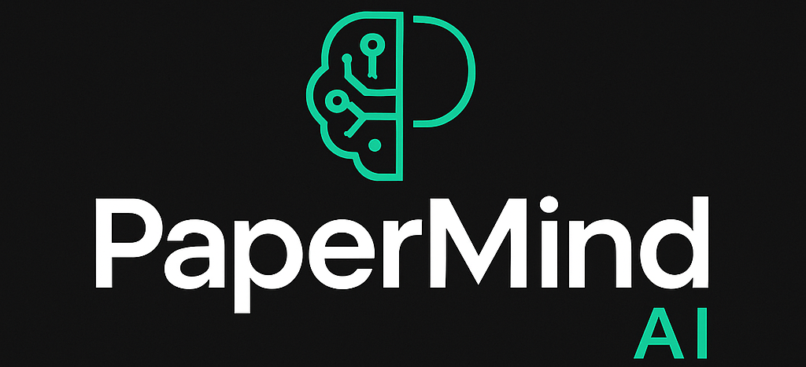

<p align="center">
  
</p>
<p align= 'center'>
  


</p>
<h2 align="center">PaperMind AI</h2>

<p align="center">
An intelligent local-first PDF assistant that leverages Retrieval-Augmented Generation (RAG), LangChain, and powerful open-source language models to allow natural language interaction with documents — securely and offline.
</p>

---

### 🧠 Overview

**PaperMind AI** is a local, privacy-focused PDF Chat Assistant that allows users to upload PDF files and ask natural language questions based on their content. It's powered by:

- **TinyLLaMA-1.1B-Chat-v1.0** for local chat inference
- **all-MiniLM-L6-v2** for semantic understanding and vector embeddings
- **FAISS** for fast vector search
- **LangChain** for orchestration of the RAG pipeline

Built with a modern, responsive **HTML/CSS/JS frontend** and **FastAPI backend**, PaperMind AI delivers a smooth and minimal experience akin to commercial AI tools — but fully offline and transparent.

---

### 🚀 Features

- ✅ Upload any PDF document
- ✅ Ask questions naturally about the file
- ✅ Local-first inference — no cloud API keys required
- ✅ Vector search powered by FAISS
- ✅ RAG pipeline using LangChain
- ✅ Minimal frontend with drag-and-drop UX
- ✅ Modular backend (FastAPI) for extensibility

---

### 📁 Project Structure

```

PaperMind-AI/
├── frontend/               # HTML, CSS, and JS assets for UI
│   ├── index.html
│   ├── styles.css
│   └── script.js
├── uploads/                # Stores uploaded PDF files
├── vectorstore/            # FAISS index for document chunks
│   └── index.faiss
├── app.py                  # FastAPI server with endpoints
├── ingest.py               # PDF ingestion & vectorization
├── chat.py                 # Query processing and RAG pipeline
└── README.md

````

---

### 📦 Tech Stack

| Layer        | Technology                                  |
|--------------|---------------------------------------------|
| UI           | HTML, CSS, JavaScript                       |
| Backend      | FastAPI                                     |
| ML Models    | TinyLLaMA-1.1B-Chat-v1.0, all-MiniLM-L6-v2  |
| RAG Pipeline | LangChain                                   |
| Vector Store | FAISS                                       |
| Embedding    | Hugging Face Sentence Transformers          |

---

### 🔧 Installation

> Ensure you have Python 3.10+ and `virtualenv` set up.

```bash
git clone https://github.com/shivamprasad1001/PaperMind-AI.git
cd PaperMind-AI
python -m venv venv
source venv/bin/activate   # or venv\Scripts\activate on Windows
pip install -r requirements.txt
````

---

### ▶️ Running the App

```bash
# Start the backend API server
uvicorn app:app --reload

# Then open the frontend/index.html in your browser
```

---

### 🛠️ Models Used

* [TinyLLaMA-1.1B-Chat-v1.0](https://huggingface.co/cognitivecomputations/TinyLlama-1.1B-Chat-v1.0)
* [all-MiniLM-L6-v2](https://huggingface.co/sentence-transformers/all-MiniLM-L6-v2)

These models are downloaded and loaded locally, ensuring full privacy and speed.

---

### 🧪 API Endpoints

| Method | Endpoint       | Description                   |
| ------ | -------------- | ----------------------------- |
| POST   | `/upload-pdf/` | Upload and ingest a PDF file  |
| POST   | `/chat/`       | Query PDF using RAG inference |

---

### 🛡️ Privacy First

All computation is done locally. No data is sent to any external servers or APIs.

---

### 📌 Roadmap

* [x] v1.0 — Local PDF Chat Assistant
* [ ] v1.1 — Multi-PDF ingestion
* [ ] v1.2 — UI improvements & context memory
* [ ] v2.0 — File upload via drag-and-drop in browser + Electron desktop app

---

### 🧩 Contributions

Contributions, issues, and suggestions are welcome. Please open a pull request or start a discussion!

---

### 📜 License

MIT License © 2025 Shivam Prasad

---


> Built with ❤️ and a passion for open-source AI tools by [Shivam Prasad](https://github.com/shivamprasad1001)

