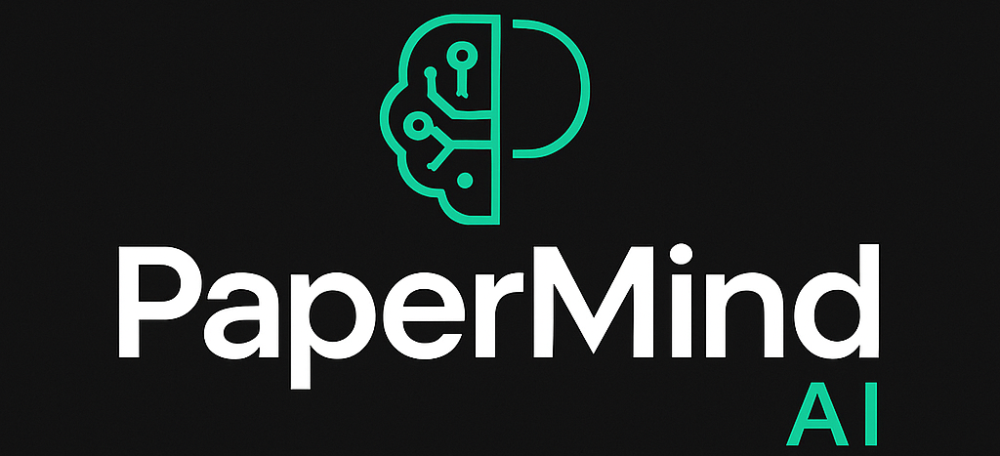

# PaperMind AI v2

A modern PDF document chat application powered by AI that allows you to upload PDF documents and have intelligent conversations about their content.

---
<p align="center">
  
</p>
<p align= 'center'>
  


---
## Features

- **PDF Upload & Processing**: Upload PDF documents and extract text content
- **AI-Powered Chat**: Chat with your documents using Google's Gemini AI
- **Smart Context Retrieval**: Uses Pinecone vector database for relevant context
- **Real-time Streaming**: Get AI responses in real-time with streaming
- **Responsive Design**: Modern, responsive UI that works on all devices
- **Document Preview**: Preview uploaded documents in a side panel
- **Chat History**: Maintains conversation history for each document

## Tech Stack

### Frontend
- **React 18** with TypeScript
- **Vite** for fast development and building
- **Tailwind CSS** for styling
- **React Dropzone** for file uploads
- **React Markdown** for rich text rendering
- **Axios** for API communication

### Backend
- **Node.js** with TypeScript
- **Express.js** for API server
- **Google Gemini AI** for text embeddings and chat completions
- **Pinecone** for vector database and similarity search
- **PDF-parse** for PDF text extraction
- **Multer** for file upload handling

## Prerequisites

- Node.js 18+ 
- pnpm 9+
- Google Gemini API key
- Pinecone API key and index

## Setup Instructions

### 1. Clone and Install Dependencies

```bash
git clone <repository-url>
cd papermind-ai-v2
pnpm install
```

### 2. Environment Configuration

#### Backend Environment
Copy the example environment file and configure your API keys:

```bash
cd backend
cp env.example .env
```

Edit `.env` and add your API keys:
```env
PORT=3001
FRONTEND_URL=http://localhost:5173

# API Keys (Replace with your actual keys)
GEMINI_API_KEY=your_gemini_api_key_here
PINECONE_API_KEY=your_pinecone_api_key_here
PINECONE_INDEX=your_pinecone_index_name_here
```

#### Frontend Environment
```bash
cd frontend
cp env.example .env
```

Edit `.env`:
```env
VITE_API_BASE_URL=http://localhost:3001
```

### 3. Pinecone Setup

1. Create a Pinecone account at [pinecone.io](https://pinecone.io)
2. Create a new index with:
   - Dimensions: 768 (for text-embedding-004 model)
   - Metric: cosine
   - Cloud: Choose your preferred region
3. Copy your API key and index name to the backend `.env` file

### 4. Google Gemini Setup

1. Get your API key from [Google AI Studio](https://makersuite.google.com/app/apikey)
2. Add it to the backend `.env` file

## Development

### Start Both Frontend and Backend
```bash
pnpm dev
```

### Start Only Frontend
```bash
pnpm dev:frontend
```

### Start Only Backend
```bash
pnpm dev:backend
```

### Build for Production
```bash
pnpm build
```

## API Endpoints

### POST `/api/upload`
Upload and process a PDF document.

**Request**: Multipart form data with `file` field
**Response**: 
```json
{
  "message": "File uploaded and processed successfully.",
  "document": {
    "id": "doc-1234567890",
    "name": "document.pdf"
  }
}
```

### POST `/api/chat`
Chat with a document using streaming response.

**Request**:
```json
{
  "message": "What is this document about?",
  "documentId": "doc-1234567890"
}
```

**Response**: Server-sent events stream with AI response chunks.

## Project Structure

```
papermind-ai-v2/
├── frontend/                 # React frontend application
│   ├── src/
│   │   ├── components/       # React components
│   │   ├── context/         # React context providers
│   │   ├── hooks/           # Custom React hooks
│   │   ├── services/        # API and utility services
│   │   └── types.ts         # TypeScript type definitions
│   ├── package.json
│   └── vite.config.ts
├── backend/                  # Node.js backend API
│   ├── src/
│   │   ├── controllers/     # Request handlers
│   │   ├── middleware/      # Express middleware
│   │   ├── routes/          # API routes
│   │   ├── services/        # Business logic services
│   │   └── app.ts           # Express app setup
│   ├── package.json
│   └── tsconfig.json
└── package.json             # Root monorepo configuration
```

## Contributing

1. Fork the repository
2. Create a feature branch
3. Make your changes
4. Add tests if applicable
5. Submit a pull request

## License

This project is licensed under the MIT License.

## Support

For support and questions, please open an issue on GitHub.
